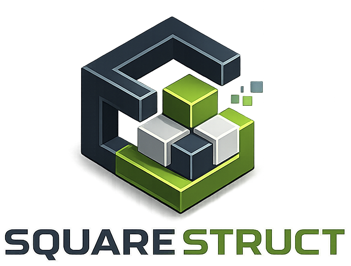

<p align="center">
  
</p>

<p align="center">
  <a href="https://img.shields.io/badge/React-19.2.5-61dafb?logo=react&logoColor=white&style=flat-square"></a>
  <a href="https://img.shields.io/badge/Vite-8.0.10-646cff?logo=vite&logoColor=white&style=flat-square"></a>
  <a href="https://img.shields.io/badge/Node.js-22.17.0-339933?logo=node.js&logoColor=white&style=flat-square"></a>
  <a href="https://img.shields.io/badge/Express-5.1.0-000000?logo=express&logoColor=white&style=flat-square"></a>
  <a href="https://img.shields.io/badge/MySQL-8.4-4479a1?logo=mysql&logoColor=white&style=flat-square"></a>
</p>

<p align="center">
  <a href="https://img.shields.io/badge/Docker-2496ed?logo=docker&logoColor=white&style=flat-square"></a>
  <a href="https://img.shields.io/badge/JWT-black?logo=jsonwebtokens&logoColor=white&style=flat-square"></a>
  <a href="https://img.shields.io/badge/Postman-ff6c37?logo=postman&logoColor=white&style=flat-square"></a>
  <a href="https://img.shields.io/badge/Jest-c21325?logo=jest&logoColor=white&style=flat-square"></a>
  <a href="https://github.com/Key-Claw/squarestruct-app/actions/workflows/tests.yml"></a>  
  <a href="./LICENSE"></a>
</p>

<h2 align="center">Aplicacion web full stack para catalogo, pedidos y gestion de construccion modular sostenible</h2>

SquareStruct es una aplicacion web centrada en construccion modular sostenible. La version actual es la **V2**: una aplicacion full stack con frontend React, API REST Express, base de datos MySQL/MariaDB, autenticacion JWT, roles, catalogo conectado a backend, carrito, checkout, pedidos, facturacion de usuario y paneles de administracion.

La MVP queda como contexto historico: sirvio para validar el flujo inicial de registro, login, catalogo y carrito visual. La documentacion actual describe principalmente el estado real de V2.

## Tabla De Contenidos

- [Funcionalidades](#funcionalidades)
- [Tecnologias](#tecnologias)
- [Arquitectura](#arquitectura)
- [Instalacion](#instalacion)
- [Base de datos](#base-de-datos)
- [Comandos](#comandos)
- [API y Postman](#api-y-postman)
- [Testing y CI](#testing-y-ci)
- [Documentacion](#documentacion)
- [Roadmap](#roadmap)

## Funcionalidades

- SPA con React, Vite y `HashRouter`.
- Navegacion principal: inicio, galeria, catalogo, disenador, sobre nosotros y area privada.
- Login, registro, cierre de sesion y persistencia local de JWT.
- Roles `usuario` y `admin`.
- Rutas protegidas en frontend para secciones privadas y administrativas.
- API REST con Express y MySQL mediante `mysql2/promise`.
- Catalogo de productos cargado desde `/api/productos`, con fallback local de datos demo.
- Busqueda por nombre o descripcion, filtros por tipo/material/precio, ordenacion, paginacion y cambio de vista.
- Carrito lateral con cantidades, eliminacion de productos y calculo de total.
- Checkout conectado al backend: crea pedidos autenticados desde el carrito.
- Facturas del usuario a partir de pedidos reales.
- Panel admin de usuarios: listado, busqueda, filtro por rol, detalle, edicion y eliminacion logica/anominizada.
- Panel admin de facturacion: historial de pedidos, filtros, estadisticas y cambio de estado a `aceptado` o `denegado`.
- Escritura de productos protegida por rol admin en backend.
- Cancelacion logica de pedidos desde API.
- Notificaciones y confirmaciones con SweetAlert2.
- Loaders, estados vacios, mensajes de error y layout responsive.
- Docker Compose para MySQL y entorno completo.
- GitHub Actions para backend, frontend, lint y build.
- Colecciones Postman para MVP historica y V2.

## Tecnologias

| Parte | Tecnologias reales |
| --- | --- |
| Frontend | React 19, Vite 8, React Router DOM 7, HashRouter, Bootstrap 5, CSS modular, SweetAlert2 |
| Backend | Node.js, Express 5, mysql2/promise, JWT, bcrypt, dotenv, CORS |
| Base de datos | MySQL 8.4 en Docker local, MySQL 8.0 en CI, modelo compatible con MariaDB |
| Testing | Vitest, Testing Library, Jest, Supertest, Postman |
| Calidad y entrega | ESLint, Docker, Docker Compose, GitHub Actions, GitFlow |

## Arquitectura

```text
squarestruct-app/
  frontend/
    src/
      components/    Auth, catalogo, layout, carrito, checkout y cuenta
      pages/         Home, Gallery, Catalog, Design, AboutUs y Settings
      services/      Cliente API, auth, productos y pedidos
      styles/        CSS base, paginas, layout y componentes
      utils/         Validadores, alertas y normalizacion de texto
      App.jsx        Rutas, estado global de usuario, carrito y overlays
      routes.js      Rutas principales y aliases

  backend/
    db/              Schema, seeds, migraciones y consultas SQL
    postman/         Colecciones Postman MVP y V2
    src/
      routes/        Usuarios, productos, pedidos y perfil
      controllers/   Logica HTTP y acceso a base de datos
      middlewares/   JWT, admin y validaciones
      app.js         Express, CORS, JSON, rutas y pool MySQL
    tests/           Jest + Supertest
    server.js        Arranque del servidor

  docker/            Compose de desarrollo y entorno completo
  docs/              Documentacion tecnica organizada
  .github/workflows/ CI de backend y frontend
```

El frontend consume la API mediante `frontend/src/services/api.js`. El cliente usa `VITE_API_URL` si esta definida; si no, llama a `/api`, que en desarrollo pasa por el proxy de Vite hacia `http://localhost:3000`.

## Instalacion

```bash
git clone https://github.com/Key-Claw/squarestruct-app.git
cd squarestruct-app

cd backend
npm install

cd ../frontend
npm install
```

## Base De Datos

Para desarrollo local se recomienda levantar solo MySQL con Docker:

```bash
docker compose -f docker/docker-compose-dev.yml up -d
```

El contenedor carga:

- `backend/db/schema.sql`
- `backend/db/seeds.sql`

Configura `backend/.env` a partir de `backend/.env.example`:

```env
PORT=3000
DB_HOST=localhost
DB_PORT=3306
DB_USER=admin
DB_PASSWORD=20doblajepuro37
DB_NAME=squarestruct
JWT_SECRET=CAMBIA_ESTA_CLAVE
NODE_ENV=development
```

## Comandos

Backend:

```bash
cd backend
npm run dev
npm test
npm run test:unit
npm run test:integration
```

Frontend:

```bash
cd frontend
npm run dev
npm run test:run
npm run lint
npm run build
```

URLs locales habituales:

```text
Frontend: http://localhost:5173
Backend:  http://localhost:3000
Health:   http://localhost:3000/api/health
DB:       http://localhost:3000/api/db-status
```

## API Y Postman

La API principal esta documentada en [`docs/04-api/endpoints.md`](docs/04-api/endpoints.md).

Colecciones disponibles:

```text
backend/postman/squarestruct-mvp.postman_collection.json
backend/postman/squarestruct-v2.postman_collection.json
```

La coleccion V2 cubre salud, estado de base de datos, auth, perfil, usuarios, productos y pedidos. Variables recomendadas: `baseUrl`, `token`, `adminToken`, `idUsuario`, `idProducto` e `idPedido`.

## Testing Y CI

GitHub Actions ejecuta:

- tests de backend con MySQL de servicio;
- tests de frontend con Vitest;
- lint de frontend;
- build de produccion con Vite.

Workflow: [`.github/workflows/tests.yml`](.github/workflows/tests.yml).

## Documentacion

El indice principal esta en [`docs/README.md`](docs/README.md).

Documentos clave:

- [`docs/01-proyecto/vision-general.md`](docs/01-proyecto/vision-general.md)
- [`docs/03-arquitectura/frontend-estructura.md`](docs/03-arquitectura/frontend-estructura.md)
- [`docs/03-arquitectura/backend-estructura.md`](docs/03-arquitectura/backend-estructura.md)
- [`docs/03-arquitectura/base-de-datos.md`](docs/03-arquitectura/base-de-datos.md)
- [`docs/04-api/endpoints.md`](docs/04-api/endpoints.md)
- [`docs/05-testing/ci-github-actions.md`](docs/05-testing/ci-github-actions.md)
- [`docker/README.md`](docker/README.md)

## Roadmap

| Version | Estado | Alcance |
| --- | --- | --- |
| MVP v1 | Cerrada | Registro, login, catalogo inicial, carrito visual y base administrativa. |
| V2 | Actual | Aplicacion full stack estilizada con pedidos, checkout, facturacion, roles, tests, Docker y CI. |
| V3 | Futura | Disenador 3D real, persistencia de planos, presupuesto avanzado y despliegue productivo. |

## Licencia

Este proyecto esta bajo licencia MIT. Consulta [`LICENSE`](LICENSE).
